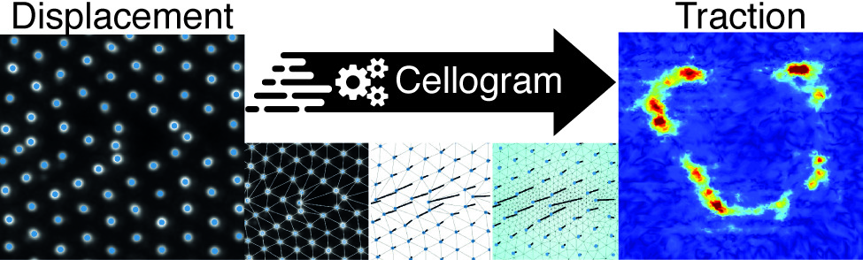
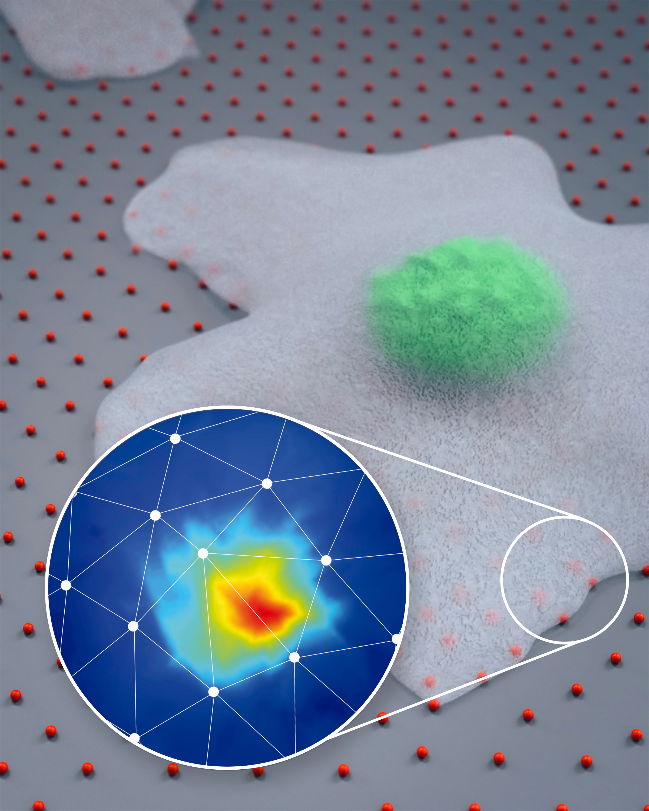

# Cellogram: On-the-Fly Traction Force Microscopy

*Tobias Lendenmann[^1] [^2], Teseo Schneider[^2], Jérémie Dumas[^2] [^3], Marco
Tarini[^4], Apratim Bajpai[^5], Weiqiang Chen[^5], Dimos Poulikakos[^1],
Aldo Ferrari[^7][^1][^6], Daniele Panozzo[^2]*

[^1]: ETH Zurich, Laboratory of Thermodynamics in Emerging Technologies,
8092 Zurich, Switzerland

[^2]: New York University, Courant Institute of Mathematical Sciences, New
York 10003, USA

[^3]: nTopology, New York 10013, USA

[^4]: Università degli Studi di Milano, Department of Computer Science,
20133 Milano, Italy

[^5]: New York University, Department of Mechanical and Aerospace
Engineering, New York 11201, USA

[^6]: ETH Zurich, Institute for Mechanical Systems, 8092 Zürich, Switzerland

[^7]: EMPA, Swiss Federal Laboratories for Materials Science and Technology,
8600 Dübendorf, Switzerland

<br>

[](https://doi.org/10.1021/acs.nanolett.9b01505)

!!! abstract
    Traction force microscopy (TFM) derives maps of cell-generated forces, typically in the nanonewton range, transmitted to the extracellular environment upon actuation of complex biological processes. In traditional approaches, force rendering requires a terminal, time-consuming step of cell deadhesion to obtain a reference image. A conceptually opposite approach is provided by reference-free methods, opening to the on-the-fly generation of force maps from an ongoing experiment. This requires an image processing algorithm keeping the pace of the biological phenomena under investigation. Here, we introduce an integrated software pipeline rendering force maps from single reference-free TFM images seconds to minutes after their acquisition. The algorithm tackles image processing, reference image estimation, and finite element analysis as a single problem, yielding a robust and fully automatic solution. The method’s capabilities are demonstrated in two applications. First, the mechanical annihilation of cancer cells is monitored as a function of rising environmental temperature, setting a population threshold at 45 °C. Second, the fast temporal correlation of forces produced across individual cells is used to map physically connected adhesion points, yielding typical lengths that vary as a function of the cell cycle phase.

## Introduction

The Cellogram software package contains custom-developed software for
the analysis of reference free traction force images. The software
comprises of marker detection, reference position estimation and finite
element analysis in order to compute surface traction fields. Details on
the underlying algorithms are provided in the supplementary information.

The entire code is contained in `src/` folder. The Cellogram binary is
in the `binary/` folder (there is no need to compile the code).
A folder with examples of deformed quantum dot arrays and pillars are
provided in the `data/` folder.

## Requirements

Cellogram does not require any commercial software and was tested on
Windows 10 Enterprise and Mac OS X 10.14. The executable is not signed,
therefore on Mac it requires to enable the option to run untrusted
applications. The simplest way is to right click on Cellogram, select
"open" and allow it to open in any subsequent dialogues. Note that you
might need to allow running apps from not coming from the apple store.
To do so, go to `System Preferences > Security & Privacy` the
General tab and click the `App Store and identified developers` radio
button (this step requires admin priviledges).

## Download

- [:page_facing_up: Paper on Nanoletters](https://pubs.acs.org/doi/10.1021/acs.nanolett.9b01505).
- :paperclip: Supplemental 1: Technical Explanation.
- :paperclip: Supplemental 2: User Documentation.
- :computer: Download the executable.
- [:open_file_folder: Code on github](https://github.com/cellogram/cellogram).



## Citation

```bibtex
@article{Lendenmann:2019:COT,
    author = {Lendenmann, Tobias and Schneider, Teseo and Dumas, Jérémie and Tarini, Marco and Giampietro, Costanza and Bajpai, Apratim and Chen, Weiqiang and Gerber, Julia and Poulikakos, Dimos and Ferrari, Aldo and Panozzo, Daniele},
    doi = {10.1021/acs.nanolett.9b01505},
    eprint = {https://doi.org/10.1021/acs.nanolett.9b01505},
    journal = {Nano Letters},
    note = {PMID: 31538794},
    title = {Cellogram: On-The-Fly Traction Force Microscopy},
    url = {https://doi.org/10.1021/acs.nanolett.9b01505},
    year = {2019}
}
```

## Acknowledgments

We thank Francesca Michela Pramotton, Raoul Hopf, and Magaly Reyes for input during analysis and Sally Reynolds for her artistic interpretation of Cellogram leading to the app icon. We acknowledge the Computational Image Analysis in Cell and Developmental Biology in Woods Hole for providing T.L. with C code for the detection of particles.

T.L. was supported by funding from the ETH-grant ETH-12 15–1. This work was partially supported by the NSF CAREER award 1652515, the NSF grant 1835712, the SNSF grant P2TIP2_175859, a gift from Adobe Research, the American Heart Association Scientist Development Grant (16SDG31020038).
