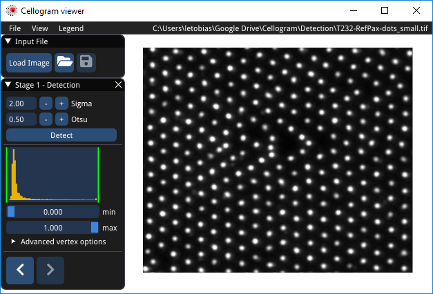
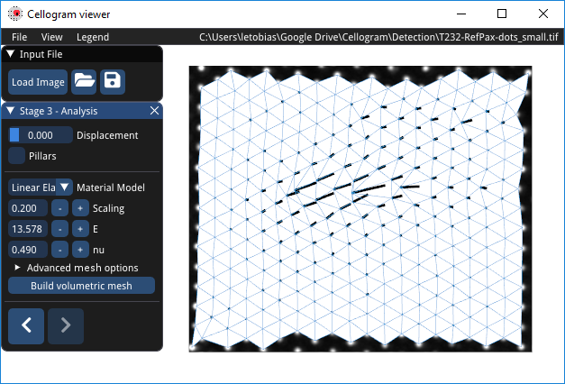
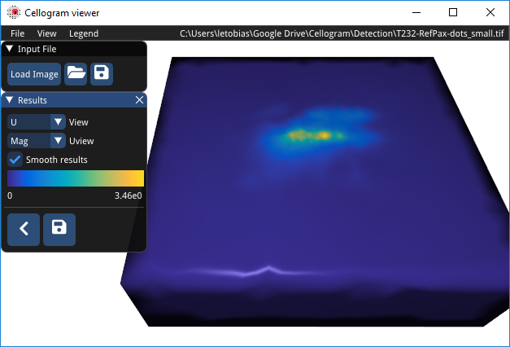

# Usage Instructions

This section explains the most important steps to calculate the traction
forces for an image. For a detailed explanation of all the fields, see
Section 4. Save the progress at any time during this process by clicking
`File > Save` or the floppy disk icon.

## Loading Image

The mouse navigates in the user interface (UI). Right click and drag
moves the field of view. The mouse wheel zooms in and out. When
Cellogram starts up there is no image loaded. First, click on the `Load Image`
in the UI or select `File > Load Image` (*Figure 1: Stage 1
- Detection*). Navigate to a grayscale image in Portable Network
Graphics (png) or Tagged Image File Format (tiff) format and select and
load the image. The image should appear as seen in the screenshot in
Figure 1.

## Marker Detection

For the detection of the markers Gaussian are fitted in the image. The
fields under `Stage 1 - Detection` are `Sigma` which determines the
size of the Gaussian that are fitted. A good starting value for is 1.5
and 3 for QDs and pillars, respectively. This value may need to adjusted
depending on magnification and marker size. To start detection click on
the `Detect` button. In case markers are missed, or detected
incorrectly they can be added or deleted under `Advanced vertex
options` or with the hot-keys `a` and `d`.

## Reference Estimation

The connectivity of the mesh is found by clicking on the right arrow
button in `Stage 1 - Detection` menu (*Figure 1*). If the meshing
step finds missing or surplus markers, it fixes them. Removed markers
are marked orange, while added markers are green. Should there be added
marker, the user has the option to move the added marker to the correct
position by clicking `Move vertex` in the `Stage 2 - Meshing` menu
before proceeding. Next click on the right arrow button to relax the
mesh and find the reference position. The displacements become visible
(*Figure 2*).

## Finite Element Analysis

For the finite element analysis (FEA) enter the material parameters in
the `Stage 3 - Analysis` menu. Hover the fields to get information on
the individual fields and units. Next click `Build volumetric mesh` to
generate a finer mesh for the analysis (*Figure 2*). The density of the
mesh is tuned in the `Advanced mesh option` see Section 4 for details.
Once the mesh is available, click the right arrow button to start the
FEA.

## Results

Once the FEA is complete and the `Results` menu is visible (*Figure 3*).
At this point the process is complete but the viewer has options to
either show the displacements `U` or the tractions `T`.

